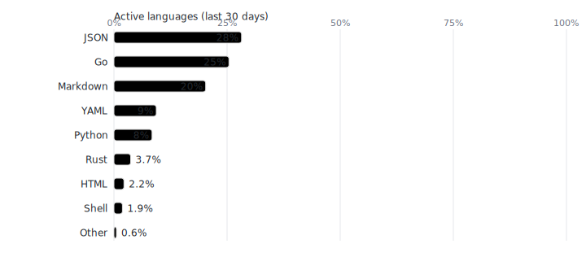

## Maksim Kleshchenok

**Principal/Staff ML & MLOps Architect.** I build high-performance AI platforms and real-time pipelines.  
Full CV (RU/EN): [HH](https://spb.hh.ru/resume/3b89b02cff0f6f749d0039ed1f70615a444248)  •  [LN](https://www.linkedin.com/in/kleshchenok/)  •  [Email](shadowklesh+github@gmail.com)

**Focus:** LLM/ML platforms (ClearML, DataHub, MinIO), GPU perf (FP8/INT4, TensorRT/Triton, NVLink/IB, k8s), realtime voice/video (WebRTC/LiveKit, low-lat TTS/ASR).  
**Value:** measurable latency/cost cuts, reproducible pipelines, incident-ready ops culture.

### Selected hacks work (KvadricepsAI)
- **Low-Poly 3D Generator** — text/image → GLB/UV/PBR in ~1 min. End-to-end demo (GameDevAI 2025 — 1st). [[repo]](https://github.com/gulldan/gamedevai2025)
- **FetalCare CTG** — ingest → analytics → clinician UI; rules+ML (NICE/ACOG/NICHD) (LCT 2025).
 [[repo]](https://github.com/gulldan/lct2025-kvadriceps-fetal-public)
- **robust face-ID** — adversarial/deepfake-resistant pipeline, eval & docs Kryptonite ML’25 — 5rd. [[repo]](https://github.com/gulldan/Kryptonite-ML-Challenge-2025)

### Stack (short)
Python • TensorRT/Triton • Kubernetes • Docker (distroless) • ClearML • ClickHouse, Cassandra, Postgres • MinIO/S3 • Spark/Polars • FastAPI/Granian • Go • Rust

### Metrics

